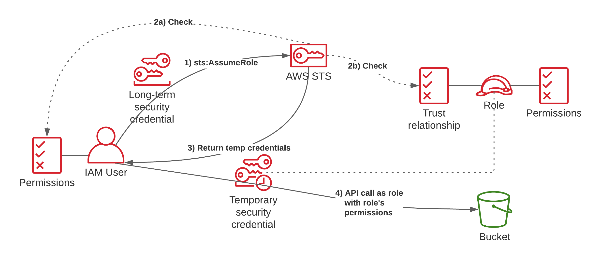

# AWS STS and Assume Role

## I. Structure

link references: https://www.tecracer.com/blog/2021/08/iam-what-happens-when-you-assume-a-role.html



1. A User has a set of credentials attached that allows them to call sts:AssumeRole. They make the API call to STS and sign the request with their long-term security credentials.

2. STS gets the API call and before it does, IAM checks if the user has permissions to make this API call in its identity-based permissions (2a). Then STS checks if the trust relationship of the role also allows the principal to assume it (2b).

3. Only if both of those checks succeed, temporary security credentials are returned to the client.

4. The user can then use the temporary security credentials to make an API call (e.g. to S3) and will have the permissions that are assigned to the role.


To me the process seemed a bit confusing when I first encountered it, but it makes a lot of sense once you understand what’s going on. Now we’re going to take a look at some common issues when assuming roles or using temporary credentials.


## II. Demonstrate `IAM User` assume `IAM Role`

### 1. Create IAM users: `sts-user` and `sts-uer-2`

### 2. Create IAM Policy allow read, put S3 objects: `read-and-put-s3-object-policy`
```json
{
    "Version": "2012-10-17",
    "Statement": [
        {
            "Sid": "Statement1",
            "Effect": "Allow",
            "Action": [
                "s3:ListBucket",
                "s3:ListAllMyBuckets",
                "s3:CreateBucket",
                "s3:GetObject",
                "s3:GetObjectVersion",
                "s3:PutObject",
                "s3:TagResource"
            ],
            "Resource": "*"
        },
        {
            "Sid": "Statement2",
            "Effect": "Allow",
            "Action": [
                "s3:GetObject",
                "s3:GetObjectVersion",
                "s3:PutObject",
                "s3:TagResource"
            ],
            "Resource": [
                "arn:aws:s3:::*"
            ]
        }
    ]
}
```

### 3. Create IAM Role: `s3-read-put-role` attach `read-and-put-s3-object-policy` policy

**Trusted Relationship Policy: allow sts-user/sts-user-2 assume role**
```json
{
    "Version": "2012-10-17",
    "Statement": [
        {
            "Sid": "Statement1",
            "Effect": "Allow",
            "Principal": {
                "AWS": [
                    "arn:aws:iam::<account-id>:user/sts-user",
                    "arn:aws:iam::<account-id>:user/sts-user-2"
                ]
            },
            "Action": "sts:AssumeRole"
        }
    ]
}
```

### 4. Create `allow-assume-s3-read-put-role` policy for `sts-user` and `sts-uer-2` IAM user:
```json
{
    "Version": "2012-10-17",
    "Statement": [
        {
            "Sid": "VisualEditor0",
            "Effect": "Allow",
            "Action": [
                "sts:GetSessionToken",
                "sts:DecodeAuthorizationMessage",
                "sts:GetAccessKeyInfo",
                "sts:GetCallerIdentity",
                "sts:GetServiceBearerToken"
            ],
            "Resource": "*"
        },
        {
            "Sid": "VisualEditor1",
            "Effect": "Allow",
            "Action": "sts:*",
            "Resource": "arn:aws:iam::<account-id>:role/s3-read-put-role"
        }
    ]
}
```

### 5. Create IAM access key pairs for `sts-user` IAM user:

**Access key for `sts-user`**
```powershell
# command:
aws iam create-access-key --user-name sts-user

# access key response
{
    "AccessKey": {
        "UserName": "sts-user",
        "AccessKeyId": "12345678",
        "Status": "Active",
        "SecretAccessKey": "12345678",
        "CreateDate": "2024-08-29T18:06:08+00:00"
    }
}

# config aws-cli profile
AWS Access Key ID [None]: 12345678
AWS Secret Access Key [None]: 12345678
Default region name [None]: ap-southeast-1
Default output format [None]
```

### 6. Create IAM access key pairs for `sts-user-2` IAM user:

**Access key for `sts-user`**
```powershell
# command:
aws iam create-access-key --user-name sts-user-2

# access key response
{
    "AccessKey": {
        "UserName": "sts-user",
        "AccessKeyId": "12345678",
        "Status": "Active",
        "SecretAccessKey": "12345678",
        "CreateDate": "2024-08-29T18:06:08+00:00"
    }
}

# config aws-cli profile
AWS Access Key ID [None]: 12345678
AWS Secret Access Key [None]: 12345678
Default region name [None]: ap-southeast-1
Default output format [None]
```

### 7. Testing `STS` and `Assume Role`
```powershell
# Step 1: command check sts user:
aws sts get-caller-identity --profile sts-user

# result
{
    "UserId": "AIDATQHCR4OM32DKQLQXJ",
    "Account": "<account-id>",
    "Arn": "arn:aws:iam::<account-id>:user/sts-user"
}

# Step 2: get token
aws sts assume-role --role-arn "arn:aws:iam::<account-id>:role/s3-read-put-role" --role-session-name "AWS_CLI_Testing_Assume_Session"

# result
{
    "Credentials": {
        "AccessKeyId": "RoleAccessKeyID",
        "SecretAccessKey": "RoleSecretKey",
        "SessionToken":"RoleSessionToken",
        "Expiration": "2024-08-29T19:15:39+00:00"
    },
    "AssumedRoleUser": {
        "AssumedRoleId": "AROATQHCR4OMTVEPKT44Z:AWS_CLI_Testing_Assume_Session",
        "Arn": "arn:aws:sts::<account-id>:assumed-role/s3-read-put-role/AWS_CLI_Testing_Assume_Session"
    }
}

# Step 3: Export data and testing s3 list bucket
export AWS_ACCESS_KEY_ID=RoleAccessKeyID
export AWS_SECRET_ACCESS_KEY=RoleSecretKey
export AWS_SESSION_TOKEN=RoleSessionToken

# Step 4: Verify who you are:
aws sts get-caller-identity

# Result
{
    "UserId": "AROATQHCR4OMTVEPKT44Z:AWS_CLI_Testing_Assume_Session",
    "Account": "<account-id>",
    "Arn": "arn:aws:sts::<account-id>:assumed-role/s3-read-put-role/AWS_CLI_Testing_Assume_Session"
}

# Step 5: Verify s3 resources:

# s3 list buckets
aws s3 ls

# 2024-07-30 15:20:57 duongdx-event-driven
# 2024-08-07 18:06:14 duongdx-terraform-state

# s3 list objects:
aws s3 ls s3://duongdx-event-driven
#                           PRE images/
#                           PRE thumbnails/
#                           PRE videos/
aws s3 ls s3://duongdx-terraform-state
#                           PRE eks-cluster/
#                           PRE terraform-kubernetes/

# s3 put objects
aws s3api put-object --bucket duongdx-event-driven --key thumbnails/hinh-nen-co-viet-nam.jpg --body  ~/Pictures/hinh-nen-co-viet-nam.jpg

# checking after put new s3 object
aws s3 ls s3://duongdx-event-driven/thumbnails/
# 2024-07-30 15:26:33       1275 134.png
# 2024-07-30 15:08:26       2023 D.png
# 2024-08-30 01:25:33     242349 hinh-nen-co-viet-nam.jp
```


## III. Demonstrate `IAM Role` assume `IAM Role`

### 1. Create IAM Role for `ec2-instance`: `ec2-profile`
```json
{
    "Version": "2012-10-17",
    "Statement": [
        {
            "Effect": "Allow",
            "Principal": {
                "Service": "ec2.amazonaws.com"
            },
            "Action": "sts:AssumeRole"
        }
    ]
}
```

### 2. Create IAM Policy allow read, put S3 objects: `read-and-put-s3-object-policy`
```json
{
    "Version": "2012-10-17",
    "Statement": [
        {
            "Sid": "Statement1",
            "Effect": "Allow",
            "Action": [
                "s3:ListBucket",
                "s3:ListAllMyBuckets",
                "s3:CreateBucket",
                "s3:GetObject",
                "s3:GetObjectVersion",
                "s3:PutObject",
                "s3:TagResource"
            ],
            "Resource": "*"
        },
        {
            "Sid": "Statement2",
            "Effect": "Allow",
            "Action": [
                "s3:GetObject",
                "s3:GetObjectVersion",
                "s3:PutObject",
                "s3:TagResource"
            ],
            "Resource": [
                "arn:aws:s3:::*"
            ]
        }
    ]
}
```

### 3. Create IAM Role: `s3-read-put-role` attach `read-and-put-s3-object-policy` policy

**Trusted Relationship Policy: allow sts-user/sts-user-2 assume role**
```json
{
    "Version": "2012-10-17",
    "Statement": [
        {
            "Sid": "Statement1",
            "Effect": "Allow",
            "Principal": {
                "AWS": [
                    "arn:aws:iam::<Account-ID>:role/ec2-profile",
                ]
            },
            "Action": "sts:AssumeRole"
        }
    ]
}
```

### 4. Create `allow-assume-s3-read-put-role` policy for `ec2-profile`:
```json
{
  "Version": "2012-10-17",
  "Statement": [
    {
            "Sid": "VisualEditor0",
            "Effect": "Allow",
            "Action": [
                "sts:GetSessionToken",
                "sts:DecodeAuthorizationMessage",
                "sts:GetAccessKeyInfo",
                "sts:GetCallerIdentity",
                "sts:GetServiceBearerToken"
            ],
            "Resource": "*"
        },
        {
            "Sid": "VisualEditor1",
            "Effect": "Allow",
            "Action": "sts:*",
            "Resource": "arn:aws:iam::<account-id>:role/s3-read-put-role"
        }
  ]
}
```


### 5. Testing `STS` and `Assume Role` for `EC2 instance profile`
```powershell
# Step 1: command check sts user:
aws sts get-caller-identity

# result
{
    "UserId": "12345678",
    "Account": "<account-id>",
    "Arn": "arn:aws:iam::<account-id>:user/sts-user"
}

# Step 2: get token
aws sts assume-role --role-arn "arn:aws:iam::<account-id>:role/s3-read-put-role" --role-session-name "AWS_CLI_Testing_Assume_Session"

# result
{
    "Credentials": {
        "AccessKeyId": "RoleAccessKeyID",
        "SecretAccessKey": "RoleSecretKey",
        "SessionToken":"RoleSessionToken",
        "Expiration": "2024-08-29T19:15:39+00:00"
    },
    "AssumedRoleUser": {
        "AssumedRoleId": "AROATQHCR4OMTVEPKT44Z:AWS_CLI_Testing_Assume_Session",
        "Arn": "arn:aws:sts::<account-id>:assumed-role/s3-read-put-role/AWS_CLI_Testing_Assume_Session"
    }
}

# Step 3: Export data and testing s3 list bucket
export AWS_ACCESS_KEY_ID=RoleAccessKeyID
export AWS_SECRET_ACCESS_KEY=RoleSecretKey
export AWS_SESSION_TOKEN=RoleSessionToken

# Step 4: Verify who you are:
aws sts get-caller-identity

# Result
{
    "UserId": "AROATQHCR4OMTVEPKT44Z:AWS_CLI_Testing_Assume_Session",
    "Account": "<account-id>",
    "Arn": "arn:aws:sts::<account-id>:assumed-role/s3-read-put-role/AWS_CLI_Testing_Assume_Session"
}

# Step 5: Verify s3 resources:

# s3 list buckets
aws s3 ls

# 2024-07-30 15:20:57 duongdx-event-driven
# 2024-08-07 18:06:14 duongdx-terraform-state

# s3 list objects:
aws s3 ls s3://duongdx-event-driven
#                           PRE images/
#                           PRE thumbnails/
#                           PRE videos/
aws s3 ls s3://duongdx-terraform-state
#                           PRE eks-cluster/
#                           PRE terraform-kubernetes/

# s3 put objects
aws s3api put-object --bucket duongdx-event-driven --key thumbnails/hinh-nen-co-viet-nam.jpg --body  ~/Pictures/hinh-nen-co-viet-nam.jpg

# checking after put new s3 object
aws s3 ls s3://duongdx-event-driven/thumbnails/
# 2024-07-30 15:26:33       1275 134.png
# 2024-07-30 15:08:26       2023 D.png
# 2024-08-30 01:25:33     242349 hinh-nen-co-viet-nam.jp
```